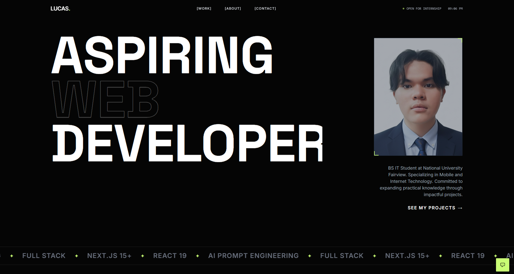

<div align="center">
<a href="https://lucas-4jo.pages.dev/" target="_blank">
  
</a>

# Lucas Portfolio

### A Modern, Interactive Portfolio Website

[](https://react.dev/)
[](https://www.typescriptlang.org/)
[](https://vitejs.dev/)
[](https://www.framer.com/motion/)
[](https://greensock.com/gsap/)

</div>

## 📖 About

A minimalist, high-performance portfolio website showcasing creative development work. Built with modern web technologies, this portfolio features:

- **🎨 Bold Typography & Design** - Ultra-modern aesthetic with smooth animations
- **💬 AI-Powered Assistant** - Interactive chatbot powered by Google Gemini 2.5 Flash
- **⚡ Blazing Fast** - Built with Vite for instant hot module replacement
- **🎭 Smooth Animations** - Leveraging Framer Motion and GSAP for fluid transitions
- **📱 Fully Responsive** - Optimized for all devices and screen sizes
- **♿ Accessible** - Semantic HTML and keyboard navigation support

## 🚀 Tech Stack

- **Frontend Framework:** React 19
- **Language:** TypeScript
- **Build Tool:** Vite
- **Animation Libraries:** Framer Motion, GSAP
- **AI Integration:** Google Gemini API
- **Styling:** Tailwind CSS (via CDN)

## 🛠️ Run Locally

**Prerequisites:** Node.js (v18 or higher)

1. **Clone the repository**
   ```bash
   git clone <repository-url>
   cd lucas-portfolio
   ```

2. **Install dependencies**
   ```bash
   npm install
   ```

3. **Set up environment variables**
   
   Create a `.env.local` file and add your Gemini API key:
   ```env
   VITE_GEMINI_API_KEY=your_api_key_here
   ```

4. **Run the development server**
   ```bash
   npm run dev
   ```

5. **Build for production**
   ```bash
   npm run build
   ```

6. **Preview production build**
   ```bash
   npm run preview
   ```

## 📂 Project Structure

```
lucas-portfolio/
├── components/          # React components
│   ├── Hero.tsx        # Landing section
│   ├── Projects.tsx    # Portfolio showcase
│   ├── About.tsx       # About section
│   ├── Contact.tsx     # Contact section
│   ├── AIAssistant.tsx # AI chatbot
│   └── ...
├── services/           # API integrations
├── public/             # Static assets
│   └── assets/         # Images and files
├── index.html          # Entry HTML
├── App.tsx             # Main app component
└── package.json        # Dependencies

```

## 🤝 Contact

Lucas Emmanuel Ramirez - [lucasemmanuelramirez56@gmail.com](mailto:lucasemmanuelramirez56@gmail.com)

[](https://www.linkedin.com/in/lucas-emmanuel-ramirez-69588637b/)
[](https://github.com/lucasram20)

---

<div align="center">
Made with ❤️ by Lucas | 4th Year BSIT Student @ National University Fairview
</div>
